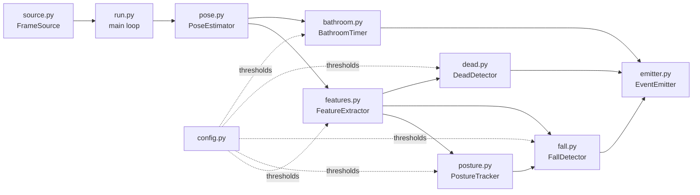

# vision

Local pose-based event detection. Each frame from a camera stream goes through a pose model, and independent detectors turn the result into events (fall, bathroom timeout, no movement). Everything runs on-device; only numbers (timestamps, confidence, measurements) are sent to the backend, never frames.

## Pipeline



Each detector returns a `FallEvent` or `None` per frame. `run.py` logs any event and forwards it to the backend (`POST /vision/events`).

## Files

| File | Role |
|---|---|
| `config.py` | Environment-driven constants (`RTSP_BASE`, `BACKEND_URL`, model paths) and one frozen dataclass of thresholds per detector. |
| `source.py` | `FrameSource` reads RTSP, a webcam or a video file. Live sources keep only the newest frame so a slow consumer never lags real time. |
| `pose.py` | `PoseEstimator` wraps MediaPipe and returns a `Pose` (33 landmarks, visibility, timestamp) or `None`. Holds landmark index constants. |
| `features.py` | `FeatureExtractor` turns a `Pose` into scale-normalised `Features` (torso angle, hip velocity, aspect, leg drop, motion). |
| `posture.py` | `PostureTracker`: debounced upright / lying / unknown classifier. |
| `fall.py` | `FallDetector` state machine. Also defines `FallEvent`, which every detector reuses. |
| `bathroom.py` | `BathroomTimer`: alerts when a person stays in view too long. Uses the raw `Pose`. |
| `dead.py` | `DeadDetector`: alerts when a detected person's pose stops moving. Uses `Features.motion`. |
| `emitter.py` | `EventEmitter` POSTs events from a background queue thread so the vision loop never blocks. |
| `run.py` | CLI entry point: wires everything together, runs the frame loop, draws the `--show` overlay. |

## Running

Run from the repo root (the package uses absolute `vision.*` imports):

```bash
python -m vision.run --camera demo                                    # rtsp://localhost:8554/demo from MediaMTX
python -m vision.run --camera demo --source webcam:0 --show
python -m vision.run --camera demo --source file:clip.mp4 --show --no-emit
python -m vision.run --camera bathroom1 --bathroom-timeout 15        # also alert after 15 min in view
python -m vision.run --camera bedroom1 --dead-timeout 10             # no-movement alert after 10 min instead of the default
```

- `--show` opens a debug overlay with posture, fall state, features, and the bathroom and dead timers.
- `--no-emit` logs events without POSTing them to the backend.
- `file:` sources use the video's own timestamps, so replays are deterministic and can run faster than real time.
- On WSL2, `webcam:N` usually can't see the Windows camera. Publish it as RTSP instead (see `tests/README.md`).
- The pose model downloads to `vision/models/` on first run. MediaPipe also needs `libgles2` and `libegl1` on Ubuntu/WSL.

## Conventions

1. **One class per event, in its own file.** It takes `camera_id` and a config in `__init__` and exposes `update(<inputs>, ts_ms) -> FallEvent | None`. `bathroom.py` is the simplest template; use `fall.py` only if you need a multi-step state machine.
2. **Thresholds go in `config.py`, not in the detector.** Add a `@dataclass(frozen=True)` config class with defaults. Put a comment above each field with its meaning and units, and use unit suffixes (`_s`, `_ms`). Detectors read from `self.cfg`.
3. **Reuse `FallEvent` with a new `kind`.** Put extra data in `details` (rounded, with a `"reason"` string). `confidence` is `"high"` or `"low"`.
4. **Time comes from the `ts_ms` argument.** Never use `time.time()` for logic, because file replays use video timestamps. `time.time()` is only used to stamp the emitted event. Config values are in seconds; detectors convert with `* 1000`.
5. **Expect `None`.** `Pose` and `Features` (and fields like `Features.motion`) can be `None`. Decide explicitly what that means for the event: ignore it, treat it as unknown, or treat it as a signal. `None` ("can't tell") is not the same as "still" or "absent".
6. **Avoid false alarms.** Use hysteresis, grace periods, cooldowns, or one-shot flags so an event fires once per occurrence, and define when it re-arms.
7. **Docs and typing.** Docstrings describe behaviour and rationale in prose. Comments say why, not what. Annotate fully with `X | None` syntax. Landmark and state names are module-level constants.
8. **New signals go in `Features`.** Add the field to `Features` and compute it in `FeatureExtractor.update`, next to the related code. Reuse the existing `scale` and `dt`, and reset any new state in `_reset()`. Detectors that only need "a person is present" can take `Pose` directly instead.

## Adding a new event

1. **Define it on paper.** Decide the trigger, the signals it needs, and what happens when the pose is `None`. Check whether `Pose` or the existing `Features` already provide the signals.
2. **Add new signals (only if needed).** Add the field to `Features` and compute it in `FeatureExtractor.update` in `features.py`. If you need a landmark that isn't listed, add its index constant in `pose.py`.
3. **Add the config class in `config.py`.** Frozen dataclass, defaults, a unit-suffixed name and a comment on every field.
4. **Create `vision/<event>.py`.** Write the detector class following the conventions above. Copy `bathroom.py` or `dead.py` as a template.
5. **Register the new `kind` in four places.** If any is missed, the backend rejects the event with a 422 or the dashboard can't describe it.
   - The `kind` comment on `FallEvent` in `vision/fall.py`.
   - The `Literal` in `FallEventIn` in `backend/routes/vision.py`.
   - The `kind` type in `frontend/src/composables/useFallEvents.ts`.
   - A branch in `describeAlert` in the same file, with a tag, title and detail message.
6. **Wire it into `run.py`.** Instantiate the detector in `main()` (with a CLI flag if it should be optional or tunable) and add its `update(...)` result to the `events` list. Optionally add its state to `_draw`.
7. **Test locally before involving the backend.**
   1. Run `python -m vision.run --source file:clip.mp4 --show --no-emit` on a recorded clip, or use a live RTSP stream with `--show --no-emit`.
   2. Use a short timeout flag so you don't wait for the real one.
   3. Watch the overlay values to set thresholds in `config.py`, then rerun.
   4. Run without `--no-emit` to confirm the event reaches the dashboard.

### Tuning notes

- Motion-based thresholds (such as `DeadConfig.motion_threshold`) must sit above landmark jitter on a motionless person and below real small movements. Read the values off the `--show` overlay while sitting still, making small movements, and moving normally.
- Test the edge cases of every detector: it fires once, it does not fire again until re-armed, it re-arms after the required movement or presence, a long pose dropout resets it, and a short dropout is ignored.
